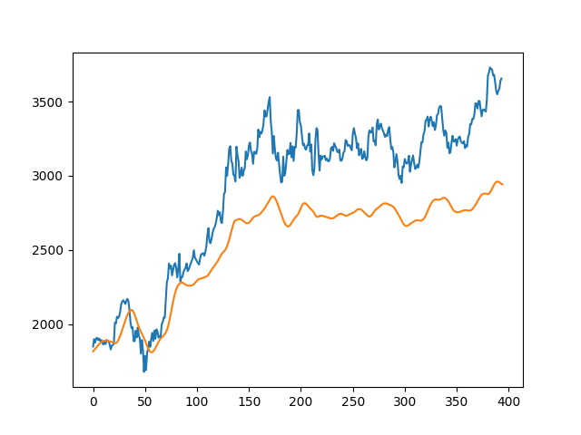

# Stock-Market-Prediction
A Python program that will predict the next day stock price of a company utilising LSTMs. Predicting the stock market requires the machine to learn from a lot of historical financial data and is difficult because of its volatile nature. The model created attempts to predict the stock price of a company (Amazon in this case) for the next one day as an experiment to show that it is possible even with the volatility of the market. 

The model was created using Tensorflow that utilised a sequential model and LSTM layers. 

## Usage
The program was developed using Python 3.8

Ensure that your machine has Tensorflow and other libraries installed for the program to run. The notable libraries used were numpy, pandas, sklearn and tensorflow. 

Note that the financial data used were downloaded from Yahoo! finance and used the [yfinance](https://github.com/ranaroussi/yfinance) module. 

## Testing & Predictions
The historical data from 1st January 2012 - 1st January 2020 was used to train the model. The plot gives a rough idea of how well the model performed and the hyperparameters can be tuned to make the predictions even more accurate.  

The model was then used on test data to predict the stock price for the following day. The test dataset included data from 1st January 2020 - 25th July 2021. The stock price of Amazon at the time of prediction is at $3656.64 a share according to Yahoo! finance. The model's prediction was $2942.06 which is not so great however it was not a bad effort but with room for a lot of improvement. 

## License
The software is under the MIT License.
